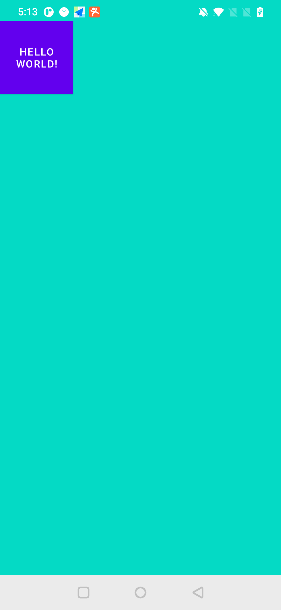
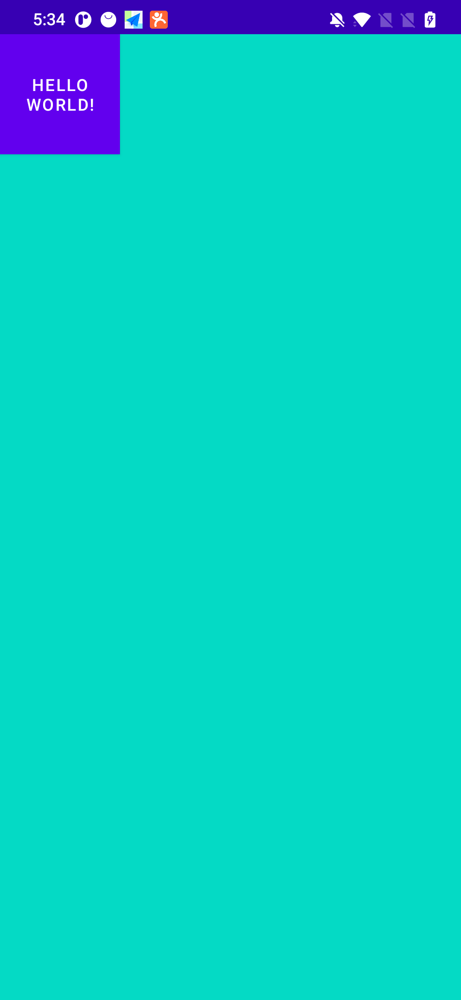

# Android ImmersiveMode

这个工程是来练习 [WindowInsetsControllerCompat](https://developer.android.com/reference/androidx/core/view/WindowInsetsControllerCompat) 的代码。

一直以来 Android 的沉浸式都是一个让我感觉到很麻烦的事情，之前 Android 官方文档使用 `View#systemUiVisibility` 来实现的，而各种 flag 理解和记忆都很麻烦。

Android 最新是推荐我们使用 WindowInsetsControllerCompat 来控制 Android 的窗口，包含statusBar 和 navigationBar。我们可以根据实际需要很简单的完成想要的效果。

## 让内容延伸到 statusBar


```kotlin
window.statusBarColor = Color.TRANSPARENT
WindowCompat.setDecorFitsSystemWindows(window, false)

ViewCompat.setOnApplyWindowInsetsListener(findViewById(R.id.root)) { view, windowInsets ->
    // 给整体内容设置一个 paddingTop，paddingTop 的值是 statusBar 的高度
    val insets = windowInsets.getInsetsIgnoringVisibility(WindowInsetsCompat.Type.statusBars())
    view.setPadding(0, insets.top, 0, 0)
    WindowInsetsCompat.CONSUMED
}
```

## 让内容延伸到 navigationBar


```kotlin
hideSystemBars(window.decorView, WindowInsetsCompat.Type.navigationBars())


private fun hideSystemBars(decorView: View, @WindowInsetsCompat.Type.InsetsType types: Int) {
    val windowInsetsController =
        ViewCompat.getWindowInsetsController(decorView) ?: return
    // Hide both the status bar and the navigation bar
    windowInsetsController.hide(types)
    // Configure the behavior of the hidden system bars
    windowInsetsController.systemBarsBehavior =
        WindowInsetsControllerCompat.BEHAVIOR_SHOW_TRANSIENT_BARS_BY_SWIPE
}

```


## 让内容延伸到 statusBar、navigationBar


```kotlin
WindowCompat.setDecorFitsSystemWindows(window, false)
// 设置全屏
hideSystemBars(window.decorView, WindowInsetsCompat.Type.systemBars())
// 处理异形屏
if (Build.VERSION.SDK_INT >= Build.VERSION_CODES.P) {
    val lp = window.attributes
    lp.layoutInDisplayCutoutMode =
        WindowManager.LayoutParams.LAYOUT_IN_DISPLAY_CUTOUT_MODE_SHORT_EDGES
    window.attributes = lp
}
ViewCompat.setOnApplyWindowInsetsListener(findViewById(R.id.root)) { view, windowInsets ->
    // 给整体内容设置一个 paddingTop，paddingTop 的值是 statusBar 的高度
    val insets = windowInsets.getInsetsIgnoringVisibility(WindowInsetsCompat.Type.statusBars())
    view.setPadding(0, insets.top, 0, 0)
    WindowInsetsCompat.CONSUMED
}

```

## 处理 Dialog show
可以在 dialog show 的时候，对 dialog 的 decorView 进行对应的处理。

```kotlin
val dialog =  AlertDialog.Builder(this)
   .show()
hideSystemBars(dialog.window!!.decorView, WindowInsetsCompat.Type.navigationBars())

```


